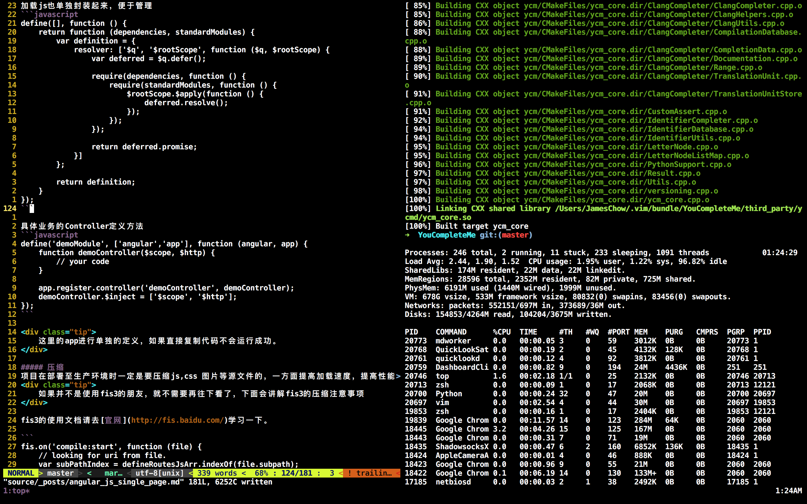

## Vim配置文件

### 概述
这个vim配置是根据我的习惯而配置的，并不是一定适合所有人，平时也就是做前端相关开发才会使用到Vim，而Java开发我是使用
Idea。而我的开发环境只有OSX和Linux两种，对于Windows上的Vim配置我并不熟悉，此配置也没有提供相关的安装脚本。

想配置强大的Vim请移步下面的链接:

1. [spf13](https://github.com/spf13/spf13-vim)
2. [ma6174](https://github.com/ma6174/vim)
3. [do-vimrc](https://github.com/humiaozuzu/dot-vimrc)
4. [ivim](https://github.com/kepbod/ivim)

### 插件列表
* [vundle](https://github.com/VundleVim/Vundle.vim)
* [vim-fugitive](https://github.com/tpope/vim-fugitive)
* [nerdtree](https://github.com/scrooloose/nerdtree)
* [syntastic](https://github.com/scrooloose/syntastic)
* [auto-pairs](https://github.com/jiangmiao/auto-pairs)
* [vim-airline](https://github.com/vim-airline/vim-airline)
* [YouCompleteMe](https://github.com/Valloric/YouCompleteMe)
* [vim-surround](https://github.com/tpope/vim-surround)
* [honza/vim-snippets](https://github.com/honza/vim-snippets)

### 绑定快捷键
* resize +10 `<leader>1`, resize -10 `<leader>2`, vertical resize -10 `<leader>3`, vertical resize +10 `<leader>4`
* 分屏之后不同之间互相移动，上移`<leader>w`,下移`<leader>s`,左移`<leader>a`,右移`<leader>d`

### 安装(只提供了Linux和osx的shell，如果使用Windows请参考上面的链接)
#### curl

```shell
sh -c "$(curl -fsSL https://raw.githubusercontent.com/JameChou/jc-vim/master/install.sh)"
```

#### wget

```shell
sh -c "$(wget https://raw.githubusercontent.com/JameChou/jc-vim/master/install.sh -O -)"
```

## tmux配置说明
1. 重新绑定了prefix &lt;C-a&gt;。
2. pane之间的切换使用prefix + (vim 上下左右)的方式。
3. 在session中可以使用prefix + ?的方式查看其他快捷键。

## 效果图

